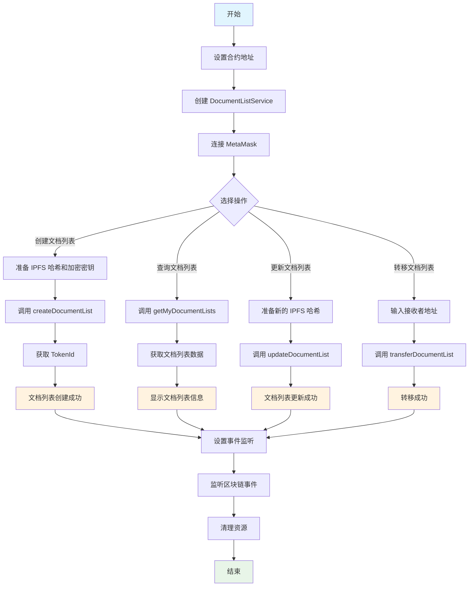

# DocumentListNFT 合约交互工具使用指南

## 概述

简化的 DocumentListNFT 合约交互工具，专注于核心功能，让文档列表 NFT 管理更简单。

## 功能特性

- ✅ **创建文档列表 NFT**：创建加密文档列表 NFT
- ✅ **更新文档列表内容**：更新文档列表和密钥
- ✅ **查询文档列表信息**：获取文档列表详情
- ✅ **用户文档列表管理**：管理个人文档列表
- ✅ **NFT 转移**：转移文档列表所有权
- ✅ **事件监听**：实时监听合约事件

## 快速开始

### 1. 配置合约地址

设置环境变量：

```bash
# .env.local
NEXT_PUBLIC_DOCUMENT_NFT_ADDRESS=0x你的合约地址
```

### 2. 基本使用

```typescript
import { DocumentListService } from './lib/contract-usage';

async function main() {
  const service = new DocumentListService();
  
  // 创建文档列表
  const tokenId = await service.createDocumentList(
    'QmExampleHash123...',
    'encrypted_aes_key_here...'
  );
  
  console.log('文档列表创建成功:', tokenId);
}
```

## 详细使用指南

### 初始化服务

```typescript
import { DocumentListService } from './lib/contract-usage';

// 使用默认配置
const service = new DocumentListService();

// 或使用自定义合约地址
const service = new DocumentListService('0x你的合约地址');
```

### 创建文档列表 NFT

```typescript
const tokenId = await service.createDocumentList(
  'QmExampleIPFSHash123...',  // IPFS 哈希
  'encrypted_aes_key_here...' // 加密的 AES 密钥
);

console.log('Token ID:', tokenId);
```

### 更新文档列表内容

```typescript
await service.updateDocumentList(
  tokenId,                     // Token ID
  'QmNewIPFSHash456...',       // 新的 IPFS 哈希
  'new_encrypted_aes_key...'   // 新的加密 AES 密钥
);

console.log('更新成功');
```

### 查询文档列表信息

```typescript
// 获取特定文档列表
const documentList = await service.getDocumentList(tokenId);
console.log('文档列表信息:', documentList);

// 获取我的所有文档列表
const myDocumentLists = await service.getMyDocumentLists();
console.log('我的文档列表:', myDocumentLists);

// 获取我的代币 ID 列表
const tokenIds = await service.getMyTokenIds();
console.log('我的代币 ID:', tokenIds);
```

### 转移文档列表 NFT

```typescript
await service.transferDocumentList(
  '0x接收者地址',    // 接收者地址
  tokenId           // Token ID
);

console.log('转移成功');
```

### 事件监听

```typescript
// 设置事件监听器
service.setupListeners();

// 监听将自动处理以下事件：
// - DocumentListCreated: 文档列表创建事件
// - DocumentListUpdated: 文档列表更新事件

// 清理事件监听器
service.cleanup();
```

## 快速使用函数

如果你只需要执行一次性操作，可以使用快速函数：

```typescript
import { 
  quickCreateDocumentList, 
  quickGetMyDocumentLists, 
  quickUpdateDocumentList 
} from './lib/contract-usage';

// 快速创建文档列表
const tokenId = await quickCreateDocumentList(
  'QmExampleHash123...',
  'encrypted_aes_key_here...'
);

// 快速获取我的文档列表
const myDocumentLists = await quickGetMyDocumentLists();

// 快速更新文档列表
await quickUpdateDocumentList(
  tokenId,
  'QmNewHash456...',
  'new_encrypted_key...'
);
```

## 错误处理

### 常见错误

1. **MetaMask 未安装** - 请安装 MetaMask 浏览器插件
2. **网络不匹配** - 请切换到正确的网络
3. **权限不足** - 确保你是 NFT 的拥有者
4. **合约地址错误** - 检查环境变量设置

### 错误处理示例

```typescript
try {
  const tokenId = await service.createDocumentList(ipfsHash, encryptedKey);
  console.log('成功:', tokenId);
} catch (error) {
  console.error('失败:', error);
}
```

## 完整工作流示例

```typescript
import { DocumentListService } from './lib/contract-usage';

async function completeWorkflow() {
  const service = new DocumentListService();
  
  try {
    // 1. 设置事件监听
    service.setupListeners();
    
    // 2. 创建文档列表
    const tokenId = await service.createDocumentList(
      'QmExampleHash123...',
      'encrypted_aes_key_here...'
    );
    
    // 3. 获取所有文档列表
    const documentLists = await service.getMyDocumentLists();
    console.log('我的文档列表:', documentLists);
    
    // 4. 更新文档列表
    await service.updateDocumentList(
      tokenId,
      'QmNewHash456...',
      'new_encrypted_key...'
    );
    
  } catch (error) {
    console.error('❌ 操作失败:', error);
  } finally {
    // 5. 清理资源
    service.cleanup();
  }
}
```

## 工作流程图



## 与现有项目集成

### 与 WalletProvider 集成

```typescript
import { useWallet } from './components/wallet-provider';
import { DocumentListService } from './lib/contract-usage';

function DocumentListManager() {
  const { address, isConnected } = useWallet();
  const [service, setService] = useState<DocumentListService | null>(null);
  
  useEffect(() => {
    if (isConnected) {
      setService(new DocumentListService());
    }
  }, [isConnected]);
  
  // 使用 service 进行文档列表操作...
}
```

### 与 IPFS 集成

```typescript
import { uploadToIPFS } from './lib/ipfs';
import { encryptWithMetaMask } from './lib/metamask-crypto';
import { DocumentListService } from './lib/contract-usage';

async function createEncryptedDocumentList(content: string, publicKey: string) {
  // 1. 加密内容
  const encryptedContent = await encryptWithMetaMask(content, publicKey);
  
  // 2. 上传到 IPFS
  const uploadResult = await uploadToIPFS(
    new TextEncoder().encode(encryptedContent)
  );
  
  // 3. 创建 NFT
  const service = new DocumentListService();
  const tokenId = await service.createDocumentList(
    uploadResult.IpfsHash,
    'encrypted_aes_key_here...'
  );
  
  return tokenId;
}
```

## 总结

这个简化的合约交互工具专注于核心功能，让您可以轻松管理文档列表 NFT：

- 🚀 **简单易用**：只需几行代码即可完成操作
- 📱 **自动初始化**：无需手动初始化，自动处理连接
- 🔒 **类型安全**：完整的 TypeScript 支持
- 🎯 **专注核心**：只包含必要的功能，代码更简洁

开始使用：设置合约地址 → 创建服务 → 调用方法 → 完成！ 