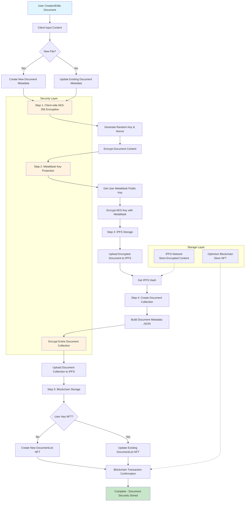

# BlueDoku Document Upload Technical Flow

This document describes the technical flow for uploading and storing documents in the BlueDoku system.

## Overview

BlueDoku uses a multi-layered security approach combining client-side encryption, MetaMask key protection, IPFS storage, and blockchain NFT management to ensure documents are securely stored and managed.

## Technical Flow Diagram

## Process Description

### Step 1: Client-side AES-256 Encryption
- User creates or edits document content
- System generates random AES-256 encryption key and nonce
- Document content is encrypted locally in the browser

### Step 2: MetaMask Key Protection
- User's MetaMask public key is obtained
- The AES encryption key is encrypted using MetaMask
- This ensures only the wallet owner can decrypt the document

### Step 3: IPFS Storage
- Encrypted document is uploaded to IPFS network
- IPFS hash is generated for content addressing
- Content is distributed across IPFS nodes

### Step 4: Document Collection Management
- Document metadata is created with encryption information
- If user has multiple documents, they are managed as a collection
- The entire collection is encrypted and uploaded to IPFS

### Step 5: Blockchain Storage
- For new users: Create new DocumentList NFT on Optimism blockchain
- For existing users: Update existing DocumentList NFT
- NFT contains reference to IPFS content and encrypted keys
- Transaction is confirmed on blockchain

## Security Features

1. **Client-side Encryption**: All encryption happens in the browser, ensuring zero-knowledge storage
2. **MetaMask Integration**: Uses wallet cryptography for key management
3. **Decentralized Storage**: IPFS ensures content availability without central servers
4. **Blockchain Verification**: NFTs provide ownership proof and immutable references
5. **Multi-layer Protection**: Content, keys, and metadata are all encrypted separately

## Technologies Used

- **Encryption**: AES-256 encryption with TweetNaCl library
- **Key Management**: MetaMask wallet integration
- **Storage**: IPFS via Pinata service
- **Blockchain**: Optimism network for NFT storage
- **Frontend**: Next.js with TypeScript 