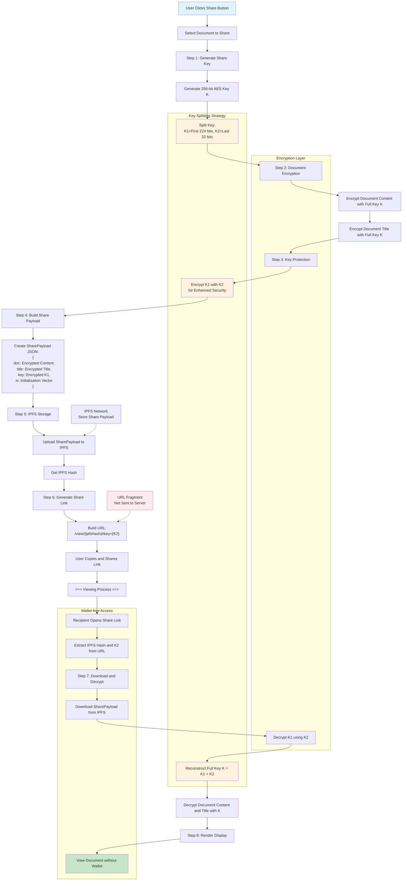

# BlueDoku Share Feature Technical Flow

This document describes the technical flow for sharing documents in the BlueDoku system.

## Overview

The BlueDoku share feature enables users to generate shareable links for their documents without requiring recipients to have a wallet. It uses advanced key splitting technology and client-side encryption to maintain security while providing convenient access.

## Technical Flow Diagram

## Process Description

### Share Creation Process

#### Step 1: Generate Share Key
- System generates a secure 256-bit AES encryption key
- Key is split into two parts: K1 (224 bits) and K2 (32 bits)
- This splitting strategy enables secure key distribution

#### Step 2: Document Encryption
- Document content is encrypted using the full 256-bit key
- Document title is separately encrypted with the same key
- All encryption occurs client-side for maximum security

#### Step 3: Key Protection
- K1 (the larger key portion) is encrypted using K2
- This adds an additional layer of security to prevent key reconstruction
- Creates dependency between both key parts

#### Step 4: Build Share Payload
- Creates a structured JSON payload containing:
  - Encrypted document content (Base64 encoded)
  - Encrypted document title (Base64 encoded)
  - Encrypted K1 key portion (hex encoded)
  - Initialization vector for decryption

#### Step 5: IPFS Storage
- Share payload is uploaded to IPFS network
- Content is distributed across decentralized nodes
- IPFS hash provides content-addressable storage

#### Step 6: Generate Share Link
- URL format: `/view/{ipfsHash}#key={K2}`
- K2 is stored in URL fragment (after #)
- URL fragments are not sent to servers, enhancing security

### Document Viewing Process

#### Step 7: Download and Decrypt
- Recipient's browser extracts IPFS hash from URL path
- K2 key portion is extracted from URL fragment
- SharePayload is downloaded from IPFS using the hash
- K1 is decrypted using K2 to reconstruct the full key

#### Step 8: Render Display
- Document content and title are decrypted using the full key
- Content is rendered in read-only mode
- No wallet connection required for viewing

## Security Features

### Key Splitting Technology
1. **256-bit Key Division**: Full encryption key split into K1 (224 bits) + K2 (32 bits)
2. **Distributed Storage**: K1 stored encrypted in IPFS, K2 in URL fragment
3. **Dependency Encryption**: K1 encrypted with K2, preventing independent use

### URL Fragment Security
1. **Client-side Only**: URL fragments (#key=...) never sent to servers
2. **Browser Isolation**: Key portion remains in user's browser
3. **No Server Logging**: Prevents key exposure in server logs

### Access Control
1. **Link-based Access**: Anyone with the complete link can view
2. **No Revocation**: Once shared, access cannot be remotely revoked
3. **Read-only Access**: Shared documents cannot be edited

## Technical Advantages

1. **Wallet-free Viewing**: Recipients don't need MetaMask or any wallet
2. **Client-side Encryption**: All cryptographic operations in browser
3. **Decentralized Storage**: No central server dependencies
4. **Instant Sharing**: One-click link generation
5. **Cross-platform Access**: Works on any device with web browser

## Technologies Used

- **Encryption**: AES-256-GCM with Web Crypto API
- **Key Management**: Custom key splitting algorithm
- **Storage**: IPFS via Pinata gateway
- **Frontend**: React with TypeScript
- **Cryptography**: Web Crypto API for browser-native encryption

## Use Cases

- **Document Collaboration**: Share drafts for review
- **Public Documentation**: Distribute guides and tutorials
- **Academic Papers**: Share research without barriers
- **Blog Posts**: Distribute content widely
- **Legal Documents**: Share contracts for review 